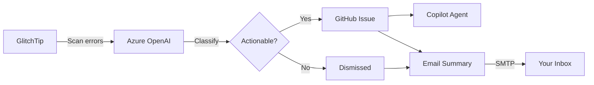

# GlitchPilot

**Your production errors, triaged and fixed before you finish your morning coffee.**

GlitchPilot connects your [GlitchTip](https://glitchtip.com) error tracker to AI-powered triage. Every night it scans your projects, decides which errors actually matter, files GitHub issues with detailed fix recommendations, and assigns GitHub Copilot to start working on them — all before your team wakes up. You get a clean summary email with everything that happened.

### What it does

1. **Scans** error groups from GlitchTip (configurable lookback window)
2. **Classifies** each error with Azure OpenAI — actionable or noise, severity, error type
3. **Files GitHub issues** with structured problem descriptions, acceptance criteria, and fix recommendations
4. **Assigns Copilot** coding agent to immediately start working on fixes
5. **Sends email** — per-project summary of all classified errors with links to GitHub issues

### How to run it

- **CLI** (`GlitchPilot.Console`) — run on-demand from your terminal
- **Azure Function** (`GlitchPilot.Functions`) — set it and forget it with a nightly timer trigger

---

## Pipeline Flow



For each monitored project, GlitchPilot collects recent errors from GlitchTip, filters by environment and occurrence count, then sends each to Azure OpenAI for classification. Actionable errors get a GitHub issue (with Copilot assigned to start fixing). Everything — actionable and dismissed — lands in a per-project email summary.

---

## CLI Modes

```bash
# Main mode — scan, classify, file issues, send email
dotnet run --project src/GlitchPilot.Console -- --mode triage

# Debug — inspect a single GlitchTip issue
dotnet run --project src/GlitchPilot.Console -- --mode probe --issue 4
dotnet run --project src/GlitchPilot.Console -- --mode probe --issue 4 --file        # also file GitHub issue
dotnet run --project src/GlitchPilot.Console -- --mode probe --issue 4 --file --email # also send email

# Debug — test GlitchTip connectivity
dotnet run --project src/GlitchPilot.Console -- --mode verify
```

---

## Azure Function

`NightlyTriageFunction` is a timer-triggered function that calls `TriagePipeline.RunAsync()` — the same code as `--mode triage`.

- Schedule is configurable via the `TRIAGE_SCHEDULE` app setting (cron format, default: `0 0 5 * * *`)
- Set `WEBSITE_TIME_ZONE` in Azure Portal for local timezone support
- All other config comes from Azure Function App Settings (same env vars as `.env`)
- Runs on Consumption plan (executes in under a few minutes)

---

## GitHub Issue Filing

- **Duplicate detection**: Label `glitchtip:{errorId}` — checked before creating
- **Issue body**: Problem description, acceptance criteria, files to investigate, stack trace, breadcrumbs, error details, tags, recommendation
- **Labels**: `glitchpilot`, `glitchtip:{errorId}`, `priority:{level}`, `type:{type}`, optional agent label
- **Copilot assignment**: Assigns `copilot-swe-agent[bot]` via GitHub API after issue creation

---

## Email Templates

- **Triage summary** (per project): Actionable issues with priority badges, OpenAI summaries, and GitHub issue links. Dismissed issues shown separately. Footer with filter settings.
- **All clear** (per project): Green checkmark, no issues need attention.
- Timestamps use local time (`DateTimeOffset.Now`)

---

## Environment Variables

| Variable | Required | Default | Description |
|----------|----------|---------|-------------|
| `GLITCHTIP_URL` | yes | | GlitchTip base URL |
| `GLITCHTIP_TOKEN` | yes | | GlitchTip API token |
| `GLITCHTIP_ORG` | yes | | GlitchTip organization slug |
| `OPENAI_ENDPOINT` | yes | | Azure OpenAI endpoint (base URL only) |
| `OPENAI_KEY` | yes | | Azure OpenAI API key |
| `OPENAI_MODEL` | no | `gpt-4o` | Deployment name |
| `GITHUB_TOKEN` | yes | | Classic PAT with `repo` scope |
| `GITHUB_LABELS` | no | `glitchpilot` | Comma-separated base labels |
| `GITHUB_AGENT_LABEL` | no | | Label for Copilot-assigned issues |
| `GITHUB_ASSIGN_TO` | no | | Username to assign issues to |
| `GITHUB_COPILOT_MODEL` | no | | Copilot model (leave empty for auto) |
| `SMTP_HOST` | yes | | SMTP server hostname |
| `SMTP_PORT` | no | `587` | SMTP port |
| `SMTP_USER` | yes | | SMTP username |
| `SMTP_PASS` | yes | | SMTP password |
| `MAIL_FROM` | yes | | Sender email address |
| `MAIL_RECIPIENTS` | yes | | Comma-separated recipient emails |
| `PROJECTS` | yes | | JSON array of monitored projects (see below) |
| `MIN_OCCURRENCES` | no | `1` | Minimum error count to consider |
| `LOOKBACK_HOURS` | no | `24` | Hours to look back for errors |
| `EXCLUDE_TITLES` | no | | Comma-separated title patterns to skip |
| `EXCLUDE_IDS` | no | | Comma-separated GlitchTip IDs to skip |
| `TRIAGE_SCHEDULE` | no | `0 0 5 * * *` | Cron schedule (Azure Function only) |

### PROJECTS format

Each entry maps a GlitchTip project to a GitHub repository:

```json
[
  {
    "slug": "my-app",
    "targetEnvironment": "Production",
    "gitHubOwner": "my-org",
    "gitHubRepo": "my-app-repo"
  },
  {
    "slug": "other-service",
    "targetEnvironment": "Production",
    "gitHubOwner": "my-org",
    "gitHubRepo": "other-service-repo"
  }
]
```

---

## DI Registration

All services are registered via `services.AddGlitchPilot()` in `Registration.cs`:

```csharp
services.AddHttpClient<IGlitchTipClient, GlitchTipClient>();
services.AddSingleton<IErrorClassifier, ErrorClassifier>();
services.AddSingleton<IIssueFiler, IssueFiler>();
services.AddSingleton<ISmtpMailer, SmtpMailer>();
services.AddTransient<TriagePipeline>();
services.AddTransient<VerifyPipeline>();
services.AddTransient<ProbePipeline>();
```

Both `Program.cs` files (Console and Functions) call the same `AddGlitchPilot()`.

---

## Key Dependencies

| Package | Purpose |
|---------|---------|
| `Azure.AI.OpenAI` | Azure OpenAI chat completions |
| `MailKit` | SMTP email delivery (STARTTLS) |
| `Octokit` | GitHub issue creation and label queries |
| `Microsoft.Azure.Functions.Worker` | Azure Functions isolated worker (Functions project only) |

---

## Known Limitations

- **Copilot model override**: Setting `GITHUB_COPILOT_MODEL` to a specific model (e.g. `claude-opus-4.6`) may cause "repository ruleset violation" errors depending on your GitHub plan. Leave empty for auto-selection.
- **Azure OpenAI gpt-5-mini**: Does not support `max_tokens` (use `max_completion_tokens`), does not support `temperature=0`, does not support `ResponseFormat`. The current code works around all of these.
